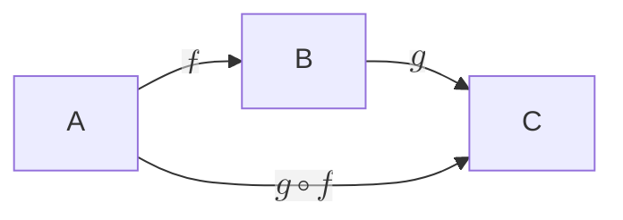
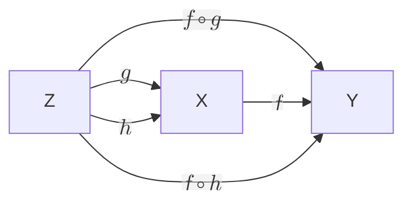
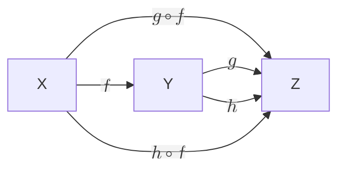
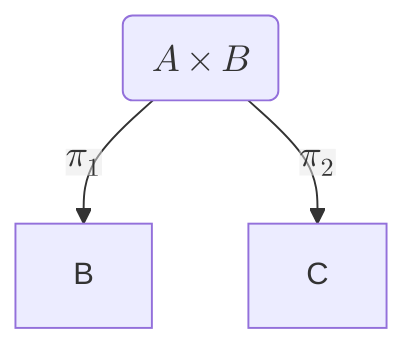
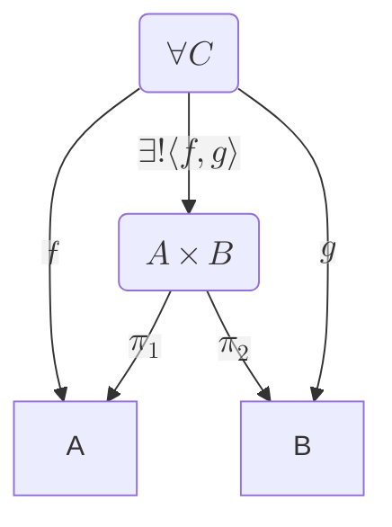
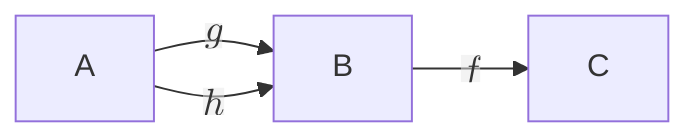
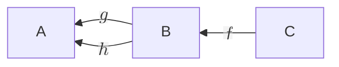

# categories
### from ["the method of coalgebra"](https://ir.cwi.nl/pub/28550/rutten.pdf), a book by j. rutten

**[def 1] a category $C$** consists of 
- objects $A, B, C...$
- for each pair of objects $A, B$, a collection $\mathcal{C}(A,B)$ of **morphisms** ("arrows") $f : A\rightarrow B$
    ($A$ is the domain, $B$ is the codomain)
- an operation called **composition** of morphisms: for any two morphisms $f : A\rightarrow B$, $g : B\rightarrow C$, 
    there is a morphism $g \circ f : A\rightarrow C$

- an **identity morphism** for each object $A$ such that $1_A : A\rightarrow A$
- axioms: $h \circ (g\circ f) = (h\circ g)\circ f$ and $f \circ 1_A = f = 1_B \circ f$

For example, a pre-ordered set ($P,\le$) is a category where: 
- objects are elements $p,q,...\in P$
- morphisms are given by the $\le$ relation: $p\rightarrow q \iff p \le q$
- compositionality results from the transitivity of $\le$: given $p\rightarrow q$ ($p\le q$) and $q\rightarrow s$ ($q\le s$), 
    we also have $p\rightarrow s$ ($p\le s$)
- identity results from the equality 
- the associativity of compositionality also results from the properties of $\le$

[With this example we notice that lattices are also categories](https://ncatlab.org/nlab/show/lattice)!

Given that we only talk about objects and arrows, it's important to be explicit about the *types* of objects (and arrows' domain/codomain). 

**[def 2] a function $f : X\rightarrow Y$ is injective** if $\forall x, y\in X: f(x) = f(y) \implies x=y$

**[def 3] a function $f : X\rightarrow Y$ is surjective** if $\forall y\in Y, \exists x\in X: f(x) = y$

**[def 4] a function $f : X\rightarrow Y$ is monic** if $\forall g, h : Z\rightarrow X, f\circ g = f\circ h \implies g = h $

**[def 5] a function $f : X\rightarrow Y$ is epic** if $\forall g, h : Y\rightarrow Z, g\circ f = h\circ f \implies g = h $

*$f$ is injective iff monic and surjective iff epic*.

We care about *how an object behaves and interacts with other objects*, rather than how it's constructed. 

**[def 6] a product of $A$ and $B$** is an object $A\times B$ with two arrows called *projections*: 

such that for all objects $C$ and arrows $f: C\rightarrow A$ and $g: C\rightarrow B$, there exists a unique arrow: 
$\lang f,g \rang : C\rightarrow A\times B$ satisfying: 

i.e., $\pi_1 \circ \lang f, g\rang = f$ and $\pi_2 \circ \lang f, g\rang = g$, with unique $\lang f, g\rang$. 
*Products are unique up to isomorphism!*

**[def 7] a functor $F: \mathcal{C}\rightarrow \mathcal{D}$** assigns:
- to each oject $A\in \mathcal{C}$ an object $F(A)\in \mathcal{D}$
- to each arrow $f: A\rightarrow B\in \mathcal{C}$ an arrow $F(f): F(A)\rightarrow F()\in \mathcal{D}$ such that 
    $F$ preserves composition and identities 
    
An object $A\in \mathcal{C}$ is initial for every object $B\in \mathcal{C}$ there exists a unique arrow $A\rightarrow B$.
An object $A\in \mathcal{C}$ is final if for any object $B\in \mathcal{C}$ there exists a unique arrow $B\rightarrow A$.

When reverting the arrows in a category we obtain a new property called *dual*. For example, reversing the monic diagram: 

$$\implies g = h$$

we obtain: 

$\implies g = h$ 

yields the epic diagram.