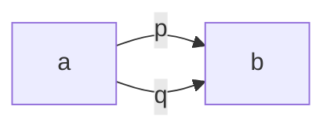

# what is homotopy type theory? 
### a talk by [Steve Awodey](https://ncatlab.org/nlab/show/Steve+Awodey)

I went into this talk by only knowing one thing about Homotopy Type Theory (HoTT): that proofs in HoTT are *not* irrelevant, and this is the reason why HoTT is not supported in Lean. 

The talk was a great introduction to approach HoTT, and here are my takeaways. 

### A note on proof irrelevance
*Proof irrelevance* is one of Lean's core design principles: once something is proven it remains such and its proof exists, 
regardless of the specific proving strategy adopted. 
However, it's useful to remember that in Lean proofs are also *values* of a certain *type*, and when 
we write a proof we are basically constructing an element of a certain type (see: [Curry-Howard](https://en.wikipedia.org/wiki/Curry%E2%80%93Howard_correspondence) isomorphism).
More specifically, given a proposition `p : Prop`, [any two elements `t1 t2 : p` are definitionally equal in Lean.](https://leanprover.github.io/theorem_proving_in_lean/propositions_and_proofs.html)

In HoTT, we think of these `t1` and `t2` as points in a space of types `X`... 
and this gives a clear intuition as to why they're not (necessarily) the same points: two points in the same space `X` aren't necessarily *the same point*. 

How to think about a constructive type theory: replace *logical formulae and proofs* by *types and terms*.

# Things learned during the talk

**TL;DR:** HoTT extends [Martin-Loef's constructive Type Theory (MLTT)](https://ncatlab.org/nlab/show/Martin-L%C3%B6f+dependent+type+theory) with a *topological interpretation*, preserving its constructive spirit.

### Types and Terms

Let's start with what we call types and terms:
| types | terms |
| ---------- | --- |
| $1$ | $*$ |
| $\mathbb{N}$ | $n$ |
| $A\times B$ | $\lang a, b\rang$ |
| $A + B$ |  $[a, b]$|
| $A \rightarrow B$ | $\lambda x.b(x)$ |

**Dependent types and terms** (such as the one Lean uses) are a further class of objects such as: 
$x : A \vdash b(x) : B(x)$, where *given an $x$ of type $A$ we define a new type $B(x)$ depending on $x$*. Bitvectors `BitVec w` are an example of this dependency, where `w : Nat` is a natural number that concurs to the definition of the bitvector type. 

Other interesting types are: 
- $\Sigma_{x:A} B(x)$, i.e., the sum of all the types $B(x)$, for all the $x$ of type $A$ (e.g., the sum of all `BitVec w` for every natural `w` - note that this is not an arithmetic sum! We are summing *types*, not bitvectors). In type theory this is an existential quantifier ([sigma type](https://en.wikipedia.org/wiki/Dependent_type)): for example, $\Sigma_{w:Nat} BitVec w$, tells us that there exists some $w : Nat$ and a bitvector *type* of that width
- $Pi_{x:A}B(x)$, i.e., the product of all the types in the family of $B(x)$. In type theory this is a [pi type](https://en.wikipedia.org/wiki/Dependent_type), and I find it comfortable to think of it as a model of universal quantifiers. 

The elephant in the room here is again the Curry-Howard correspondence, 
under which we treat proofs as programs and propositions as types: 
logical operations become type constructors, e.g. $A + B$ becomes $\alpha \lor \beta$, where $\alpha$ takes proofs of $A$ and $\beta$ takes proofs of $B$.

While I have a vague intuition for why step makes sens, internalizing it is (for me) very hard and I pinky promise to write more about Curry-Howard! 🐘

### Martin-Loef's theory

Martin-Loef introduced *identity types*, preserving the constructive spirit of the system. However, their meanig was mysterious, 
as there might be different terms $p,q : Id(a, b)$. 

Homotopy Type Theory produces an interpretation that makes sense of these $Id$ terms, by extending [Dana Scott's topological intepretation 
of $\lambda$ calculus](https://www.sciencedirect.com/science/chapter/bookseries/pii/S0049237X0871262X), which saw computability as continuity (hopefully another pinky promise).

In this interpretation, we can think of a type $X$ as a space, and of a term $t : X \rightarrow Y$ as a continuous function. 
An **identity** $p : Id_X(a, b)$ corresponds to a path $p: a \sim b$ on the space $X$, which is a continuous function $p : {0, 1}\rightarrow X$ with $p[0]=a$ and $p[1]=b$. 

All of this satisfies Martin-Loef's rules for identity types: the relation $\sim$ satisfies the laws of identity (which are witnessed by 
paths $p:a\sim b$), and the relations between paths (e.g. $\alpha : p\rightarrow q$) themselves satisfy higher laws. These paths are what we call **homotopies**.

Note that $\alpha$ is a continuous transformation/deformation (e.g. a sheet) connecting paths in the space $X$.
If we consider different said relations, e.g. $\alpha, \beta: p\rightarrow q$ we can establish more laws and continuous transformations from the one to the other, so much so that [*identity types form an infinite groupoid*](https://en.wikipedia.org/wiki/Homotopy_hypothesis). (What's an infinite groupoid? No idea, might be another pinky promise). 

The takeaway is that HoTT models Martin-Loef's type theory with topology. 
In particular, th etypes in MLTT are stratified by the level at which their infinite groupoid becomes trivial. This part was very complex for me, but the intuition I got came after an example concerning sets: in a set an identity between two points means that *trivially* the two points are the same. 

Another pinky promise: [the univalence axiom](https://ncatlab.org/nlab/show/univalence+axiom).

The last part of the talk concerned spheres and circles in HoTT and the work by [Guillaume Brunerie](https://arxiv.org/abs/1606.05916): this was way too complex for me to follow but it was great to have hints of such complex things and where they're going. 

**Takeaway**: when moving from groups to categories we lose symmetry: what do we do with asymmetrical itentities in categories?
