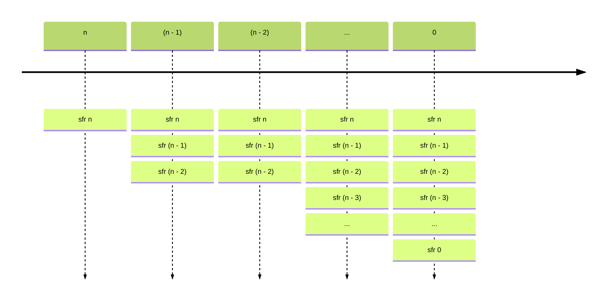
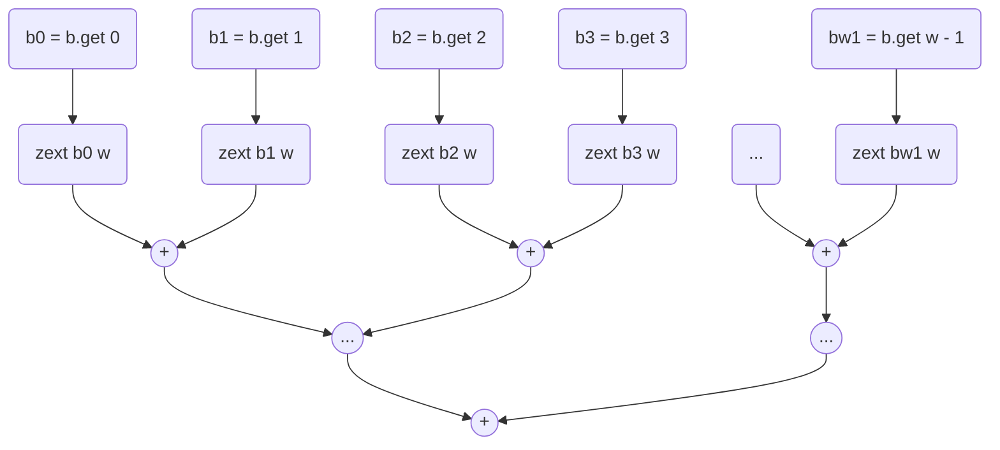
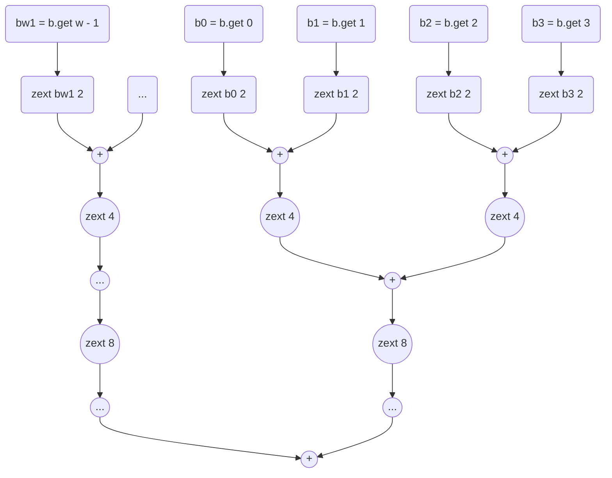
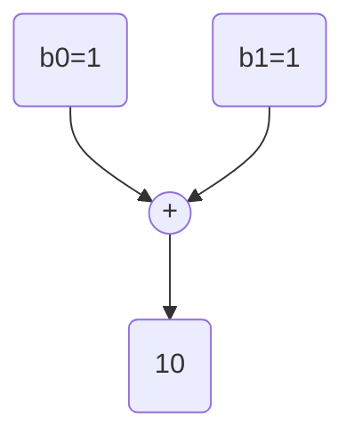
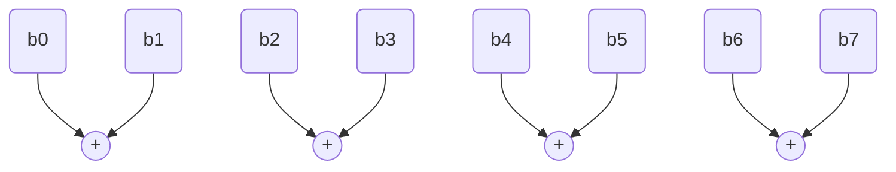
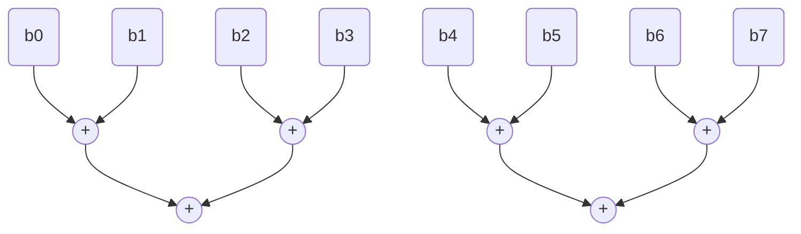
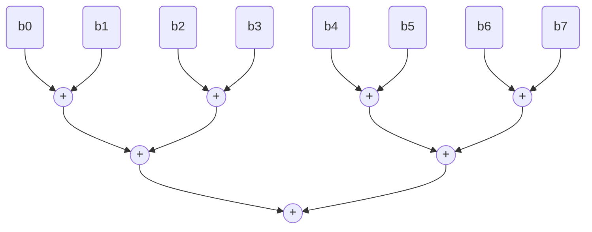

---

title: "population count"
date: 2025-08-28
---
# population count 

`popcount` (or `cpop`) is a common assembly primitive that counts the numbers of bits set to `1` in a bitvector. 
There are [various ways](https://nimrod.blog/posts/algorithms-behind-popcount/) to implement this, and 
I tried implementing them as circuits that Lean's bitblaster `bv_decide` can digest. The challenge for me 
were mainly 
1. writing the circuit in a functional language - which I'm still not used to 
2. the circuit must be tail-recursive
3. the proofs involved in their implementation require jiggling many diverse data structures and concepts.

### a note on `bv_decide`

`bv_decide` relies on constructing circuits for bitblasting: this construction itself relies on a lot of infrastructure and data structures. 
Understanding the entire process is a quest in itself - I still don't understand a big portion of it :(
Therefore, to approach the task, I am mostly looking through old PRs that added other circuits, 
I try to pattern-match behaviors that are similar to what I need and try to emulate them. 

The circuit we construct for `bv_decide` has an And-Inverted-Graph (AIG) structure, and in its construction
the main property we want to maintain is the *linearity* of the circuit. 
Basically, we want to make sure that we only *add* nodes to the circuit and never modify/update them, and 
that we have a *unique* aig as well. 
If we're careful enough, in the end, we'll have a circuit that is correct (!!) and that is also efficient. 

### a note on tail recursion:
> Tail recursion is defined as a recursive function in which the recursive call is the last statement that is executed by the function. 
> So basically nothing is left to execute after the recursion call.

The main reason we want our functions to be tail-recursive has to do with stack optimization. 
With regular recursive functions, whenever we perform a new function call we also push a new stack frame on the stack, until the base case is reached.



Once the base case is reached, the program needs to traverse backwards the previous stack frames to eventually return the value. 

With tail-recursion, we avoid this backward-traversal of the stack: the last function call will already contain the output value we're looking for!
`sfr0` contains what we need already. A trick that is often used in `bv_decide` circuits, to ensure tail-recursion, it to have an accumulator as argument of 
the function: its value gets updated at every calls and corresponds to the state of the circuit. At the final call, it will contain the whole circuit :) 

From a pure compiler perspective, tail-recursive calls can be replaced by iterations (["contol flows to the end of the function body after each call"](https://digitallibrary.srisathyasaicollege.in/bitstream/123456789/6801/1/Alfred%20V.%20Aho%2C%20Monica%20S.%20Lam%2C%20Ravi%20Sethi%2C%20Jeffrey%20D.%20Ullman-Compilers%20-%20Principles%2C%20Techniques%2C%20and%20Tools-Pearson_Addison%20Wesley%20%282006%29.pdf)): this replacement imporves the compiled program's performance. 

To understand why this is useful, I found the following example particularly useful (from the [dragon book](https://digitallibrary.srisathyasaicollege.in/bitstream/123456789/6801/1/Alfred%20V.%20Aho%2C%20Monica%20S.%20Lam%2C%20Ravi%20Sethi%2C%20Jeffrey%20D.%20Ullman-Compilers%20-%20Principles%2C%20Techniques%2C%20and%20Tools-Pearson_Addison%20Wesley%20%282006%29.pdf)):
```python
fun( ) {
    if lookahead = '+' then 
        consume('+')
        print(lookahead)
        consume(lookahead)
        print('+')
        fun ( )
    elif lookahead = '-' then 
        consume('-')
        print(lookahead)
        consume(lookahead)
        print('')
        fun ( )
}
```
that can be rewritten as
```python
fun( ) {
    L:  if lookahead = '+' then 
            consume('+')
            print(lookahead)
            consume(lookahead)
            print('+')
            goto L 
        elif lookahead = '-' then 
            consume('-')
            print(lookahead)
            consume(lookahead)
            print('')
            goto L 
}
```


## attempt 1: bitblasting circuit with [brian Kernighan's algorithm](https://graphics.stanford.edu/~seander/bithacks.html#CountBitsSetKernighan): 
This algorithm basically subtracts `1` and `and`s the bitvector until it's `0`: 
```python
    unsigned int v; # count the number of bits set in v
    unsigned int c; # c accumulates the total bits set in v
    for (c = 0; v; c++)
    {
    v &= v - 1; # clear the least significant bit set
    }
```
In the [circuit](https://github.com/leanprover/lean4/pull/9416/files), this translates to a series of `and` and `sub` nodes that needs to represent `x` at the right recursion level. 
A difficulty with this circuit is that for example, at iteration `c = i` the value of `v` will be the result of `i` `and` operations, and when we design the 
circuit tail-recursively, we need to keep that in mind and use another function `auxAnd` that computes the `and` of `v` and `v-1` exactly `i` times:
```python
auxAnd (x, iter) {
    if 0 < iter 
        x &= x - 1
        auxAnd x (iter - 1)
    else 
        x
}

popCount (x, iter, acc) 
    if 0 < iter 
        xIter = auxAnd x iter 
        cond = xIter = 0
        newNode = ITE cond, iter, acc
        acc.pushNode newNode
        popCount x (iter - 1) acc
    else 
        acc
```
I benched this circuit within `bv_decide` and ultimately it is not as fast as I was expecting, and scales really bad. 
I found understanding why something is more or less digestible by a SAT solver particularly challenging.

## attempt 2: intuitive bitblasting circuit for popcount
An alternative circuit is the most ["naive"](https://github.com/leanprover/lean4/pull/9469) one we can come up with: 
for each bit in the input we generate an `if-then-else` node where the condition is "`bit = 0`". 
This circuit performs better than Kernighan's in this context, but still scales quite dramatically. 

## attempt 3: divide-et-impera bitblasting circuit for popcount
The final alternative is to use a divide-and-conquer strategy, which is what for example [Hackers' Delight](https://github.com/hcs0/Hackers-Delight/blob/master/pop.c.txt) proposes 
(the SWAR algorithm is an even-more-specialized-and-optimized circuit). The idea is to use bitmasks an shifts to `and` bits 
such that after `log2 w` operations (where `w` is the width of the input) eventually we'll have the final number. 

In the SAT solver, I [implemented](https://github.com/leanprover/lean4/pull/9730) a slightly more general circuit that allows me to avoid generating the magic constants. 
Eventually, my circuit is a [prefix sum](https://en.wikipedia.org/wiki/Prefix_sum) circuit: we zero-extend each 
bit in the input (of width `w`) to have width `w` and then add them in couples, until a single add node is left (i.e., after $\lceil log_2 w\rceil$ layers): 



The reason why we zero-extend each bit immediately to `w` is to have inputs with the same size on for all add nodes. 
The alternative to this would be extending by one bit at a time, which is very finnicky and eventually not 
particularly effective: 



Note that we *really* need this extention, otherwise we won't be able to count correctly, for example, in the first
set of add nodes: 

without the zero-extension we'd have overflow ☹️. 

With `w=8`, at the first `blastAddVec` call from `go` we construct the first layer of addition: 

And at the second call we build the third: 

At the third call we build the fourth, containing the last addition: 

And at the fourth call we can return, given that we have one node only remaining. 

With the currently existing Lean4 infrastructure, the parallel prefix sum circuit can only exist if *flattened*, meaning that we take 
a bunch of vectors we want to sum and concatenate them into a single, longer vector. 

The core of the implementation does not change, and in fact its *denotation* is proven!

### a note on the denotation 

When I say *"the circuit denotes to a function `f` over bitvecs"*, it means that the circuit behaves exactly like that function. 
To prove this, we start with a bitvector `x`, a circuit `xc`, and a proof that circuit `xc` denotes to `x` (*"`xc` behaves exacly like `x`*). 
Then, we need to consider every port in the circuit and make sure that the behaviors it allows are the same allowed by the function and yield the same results

Moving on to our popcount circuit: we want to prove that it denotes to the popcount function over bitvectors `BitVec.popCount`.
The high-level idea is very simple: we define some functions over bitvectors that behave as the nodes we introduced for popcount 
(a function to extend each bit into a `w`-long word and concatenate it, a function to take two `w`-long words and add them, etc ...)
and first prove that the popcount nodes we introduce behave exactly like those functions.

Very high-level, we want to say that every bit of the circuit behaves as a certain function, and the circuit as a whole behaves as the combination of said functions. 

### proving that parallel prefix sum and *intuitive* sum are equivalent

The last and crucial step of this proof requires showing that the whole parallel prefix sum behaves as the "intuitive" popcount circuit ("*if bit at position `i` is true then add 1, else add 0*"), which is the complex part. 
The proof is making progess, also thanks to [bollu](https://www.pixel-druid.com)'s help, and is the most complex thing I've ever done in Lean (and tbh, with any other language really). 

The proof proceeds with two steps: 
1. We want to prove that the sum of the nodes at any depth `d` of the parallel-prefix-sum tree is constant 
2. The sum of nodes at the very first level (i.e., when the addenda are the zero-extended bits) is equivalent to the sum of all the "*if bit at position `i` is true then add 1, else add 0*" we would unfold. 

*update - 08.12.25:* I finally managed to finish the correctness proof 🥳