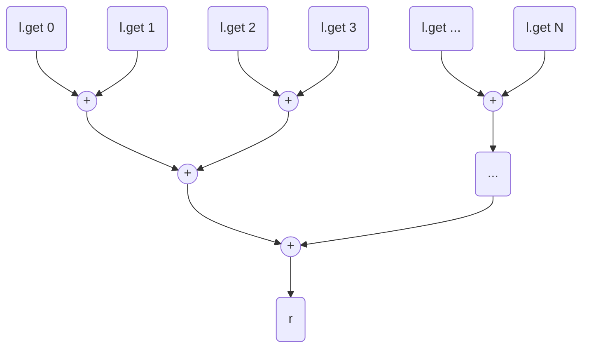

---

title: "proving the correctness of a parallel prefix sum circuit"
date: 2025-11-25
---

# proving the correctness of a parallel prefix sum circuit

When working on adding the [popcount circuit](https://luisacicolini.github.io/posts/popcount/) to `bv_decide`, 
the most complex proof required proving that summing a list of numbers via a parallel prefix sum circuit is equivalent summing them 
recursively (*sum each element of the list until all have been added*). 
Here is the gist of the proof (thank you [bollu](https://pixel-druid.com/))

I started with a recursive definition of addition on a list: 

```lean4
def recursive_addition (l : List Nat) : Nat :=
  match l with
  | [] => 0
  | head :: tail => head + recursive_addition tail
```


Recall that the parallel prefix sum circuit for a list of natural numbers `l` works as follows: 

where `r` will be the result of the addition.

To define this construction in Lean, I need two functions: 
1. A definition `pps_new_element_in_layer` that recursively generates the `(i + 1)`-th layer in the tree given the `i`-th layer, 
  where each element in the `(i + 1)`-th layer will result from the addition of two adjacent elements in the `i`-th layer. 
  At each call, the definition preserves `proof_addition`, proving that, at every recursive call, each element in `new_layer` results from
  the addition of two adjacent elements in `old_layer`, and preserve the proof in the result as well.
  We also preserve the proofs of `new_layer` and `old_layer`'s length (`hnew` and `hold`). 
  Specifically, `hnew` shows that the length of `new_layer` is `iter_num`, i.e., we add one element every time recursive call, and 
  `hold` showing the relation between the length of `old_layer` and `new_layer`. 
  The `new_layer` constructed by this definition has length `new_layer.length = (old_layer.length + 1)/2` and carries a proof 
  that all its elements result from the addition of two adjacent elements of `old_layer` (`0` in case `old_layer.length` is odd). 
```lean
def pps_new_element_in_layer 
  (old_layer : List Nat) (new_layer : List Nat) (iter_num : Nat)
  (hnew : new_layer.length = iter_num)
  (hold : 2 * (iter_num - 1) < old_layer.length)
  (proof_addition : 
      ∀ i (h: i < new_layer.length) (h' : 2 * i < old_layer.length),
        new_layer[i] = old_layer[2 * i] + 
                      (if h : 2 * i + 1 < old_layer.length 
                          then old_layer[2 * i + 1] 
                          else 0)) :
    {ls : List Nat //
      /- every element in new_layer results from the addition 
        of two adjacent elements in old_layer -/
      (∀ i (h: i < ls.length) (h' : 2 * i < old_layer.length),
        ls[i] = old_layer[2 * i] + 
                (if h : 2 * i + 1 < old_layer.length 
                    then old_layer[2 * i + 1] 
                    else 0)) ∧ 
      (ls.length = (old_layer.length + 1)/2)
    } :=
  /- we iterate untill all elements in `old_layer` are consumed -/
  match hlen : old_layer.length - (iter_num * 2) with
  | 0 =>
    ⟨new_layer, by
      /- at the last recursive call, the proofs are trivially 
        obtained from the hypotheses we require upon calling -/
      and_intros
      · exact proof_addition
      · by_cases h0 : iter_num = 0
        · simp_all
        · omega
    ⟩
  | n + 1 =>
        /- we construct the two operands -/
        let op1 := old_layer[2 * iter_num]
        /- if we reach the last element of `old_layer`, we add `0` -/
        let op2 := if hlt : (2 * iter_num + 1) < old_layer.length 
                      then old_layer[2 * iter_num + 1] 
                      else 0
        /- we append the new operation to `new_layer` -/
        let new_layer' := new_layer.append [op1 + op2]
        /- construct `hnew` for the next recursive call -/
        have proof_new_layer_length_eq_iter :
          new_layer'.length = iter_num + 1 := by simp [new_layer']; omega
        /- construct `hold` for the next recursive call -/
        have proof_old_layer_length_lt : 
          2 * (iter_num + 1 - 1) < old_layer.length := by omega
        /- construct `proof_addition` for the next recursive call -/
        have proof_new_layer_elements_eq_old_layer_add :
          ∀ (i : Nat) (h : i < new_layer'.length) (h' : 2 * i < old_layer.length),
            new_layer'[i] = old_layer[2 * i] + 
                            (if h : 2 * i + 1 < old_layer.length 
                              then old_layer[2 * i + 1] 
                              else 0 ):= by
            intros i hi hi'
            by_cases hi'' : i < new_layer.length
            · /- for the elements already in `new_layer` 
                we trivially derive the proof from in `proof_addition` -/
              simp only [List.append_eq, hi'', List.getElem_append_left,
                new_layer']
              exact proof_addition i (by omega) (by omega)
            · /- otherwise, we prove correctness by the construction
                of the newly-appended element-/
              simp only [List.append_eq, List.getElem_append, 
                show ¬i < new_layer.length by omega,
                reduceDIte, List.getElem_singleton, new_layer', op1, op2]
              simp only [show i = iter_num by omega]
        /- we invoke a new recursive call with updated arguments-/
        pps_new_element_in_layer old_layer new_layer' (iter_num + 1)
                proof_new_layer_length_eq_iter
                proof_old_layer_length_lt
                proof_new_layer_elements_eq_old_layer_add
/- to show termination, we show that the number of consumable items 
  in `old_layer` (`old_layer.length - (iter_num * 2)`) decreases -/
termination_by old_layer.length - (iter_num * 2)
```
2. A definition `parallel_prefix_sum_list` that invokes the construction of new layers in the tree until a single element remains (at the base of the tree). 
  This definition preserves the `proof` that the recursive addition of all elements at the `i`-th level of the tree remains constant, 
  and the `proof_length` showing that the length of each new layer is always greater than 0. 
```lean
def parallel_prefix_sum_list (l : List Nat) (k : Nat)
      (proof : recursive_addition l = k)
      (proof_length : 0 < l.length) :
    {ls : List Nat // recursive_addition ls = k ∧ ls.length = 1} :=
  if h : l.length = 1 then
    ⟨l, by
          and_intros
          · exact proof
          · omega⟩
  else
    /- we generate a new layer invoking `pps_new_element_in_layer` -/
    let ⟨new_layer, proof_new_layer, proof_length_new_layer⟩ := 
      pps_new_element_in_layer l [] 0 (by simp) (by simp; omega) (by simp)
    /- construct `proof` for the next recursive call -/
    let proof_sum_eq : recursive_addition new_layer = k := by
      /- we know that `proof` holds at `l`
        and need to prove the same for `new_layer` -/
      rw [← proof]
      /- `rec_add_eq_rec_add_of` proves that the recursive additions
        of two lists `a`, `b` are equivalent if all the elements in `b` 
        result from the addition of two elements in `a` -/
      apply rec_add_eq_rec_add_of 
        (a := new_layer) (b := l) (n := new_layer.length) (by omega) (by omega)
      exact proof_new_layer
    let proof_new_layer_length : 0 < new_layer.length := by omega
    parallel_prefix_sum_list new_layer k proof_sum_eq proof_new_layer_length
```

To prove that the recursive addition at different levels of the tree remains equivalent, 
we need a more general theorem showing that *given two lists `a` and `b`, where
all the elements in `a` are the results of adding two elements adjacent in `b`, recursive 
addition on `a` is equivalent to the recursive addition on `b`*.
```lean
def rec_add_eq_rec_add_of (a b : List Nat) (n : Nat)
    (hlen : a.length = (b.length + 1) / 2)
    (hn : n = a.length)
    /- as a hypothesis we know that `a` is constructed by adding 
      pairs of adjacent elements in `b` -/
    (hadd : ∀ i (hi : i < a.length) (hi' : 2 * i < b.length),
      a[i] = b[2 * i] + (if h : 2 * i + 1 < b.length then b[2 * i + 1] else 0)) :
        recursive_addition a = recursive_addition b := by
    /- the proof proceeds by induction on the length of `a`: we want to show that 
      every time we add an element `e` in the recursive addition on `a` 
      we add two elements `e1`, `e2` (such that `e = e1 + e2`, 
      potentially with `e2 = 0`) in the recursive addition on `b` -/
    induction n generalizing a b
    · /- if `a` is empty, we can show that `b` is too, and 
        the recursive additions are trivially equivalent -/
      have hblen : b.length = 0 := by omega
      have hb := (List.length_eq_zero_iff (l := b)).mp hblen
      have ha := (List.length_eq_zero_iff (l := a)).mp (by omega)
      simp [ha, hb]
    · case _ n ihn =>
      /- we decompose `a` as `a = taila ++ [ha']`, 
         concatenating the last element `h` -/
      obtain ⟨ha', taila, htaila⟩:= exists_concat_of_length_eq_add_one 
                                    (l := a) (n := n) (by omega)
      /- we rewrite the recursive addition: 
        `recursive_addition (taila ++ [ha']) = (recursive_addition taila) + ha'` -/
      rw [htaila, concat_recursive_addition]
      /- we show that `ha'` is the last element of `a` -/
      have hahead : ha' = a[n] := by
        simp [htaila]
        rw [List.getElem_concat_length (by simp [htaila] at hn; exact hn)]
      /- we rewrite using `ha' = a[n]` and using `hadd`, to show 
        that `a[n] = b[2 * n] + 
                     (if h : 2 * i + 1 < b.length then b[2 * i + 1] else 0` -/
      rw [hahead, hadd (i := n) (by omega) (by omega)]
      /- we reason separately about the cases where the second operand we obtain 
        from b is `0` (last addition when `b` has odd length) 
        or is a regular element in `b` -/
      split
      · /- a[n] = b[2 * n] + b[2 * n + 1] -/
        case _ ht =>
        have hblenle: 2 ≤ b.length := by omega
        /- we decompose `b` as `b = tailb ++ [e1] ++ [e2]` and rewrite it -/
        obtain ⟨e1, e2, tailb, htailb⟩ := concat_eq_of_le_two (l := b) (by omega)
        conv =>
          rhs
          /- we rewrite the recursive addition: 
          `recursive_addition (tailb ++ [e1] ++ [e2]) = 
            (recursive_addition tailb) + e1 + e2` -/
          rw [htailb, 
              concat_recursive_addition, 
              concat_recursive_addition]
        /- we now need to show that 
           `(recursive_addition taila) + ha' = (recursive_addition tailb) + e1 + e2`, 
           i.e., the recursive addition on `taila` and `tailb` are equivalent, 
           and `ha' = e1 + e2`-/
        have hblen : b.length = tailb.length + 2 := by subst htailb; simp
        have halen : a.length = taila.length + 1 := by subst htaila; simp
        /- we show that `e1` is `b[2 * n]` -/
        have he1 : b[2 * n] = e1 := by
          simp [htailb]
          rw [List.getElem_append]
          have : 2 * n = tailb.length := by omega
          simp [show ¬ 2 * n < tailb.length by omega, 
            show 2 * n - tailb.length = 0 by omega]
        /- we show that `e2` is `b[2 * n + 1]` -/
        have he2 : b[2 * n + 1] = e2 := by
          simp [htailb]
          rw [List.getElem_append]
          have : 2 * n = tailb.length := by omega
          simp [show ¬ 2 * n + 1 < tailb.length by omega, 
            show 2 * n + 1 - tailb.length = 1 by omega]
        /- we rewrite showing that the newly added 
          `a[n] = ha' = b[2 * n] + b[2 * n + 1]` is equivalent to 
          `b[2 * n] + b[2 * n + 1] = e1 + e2`-/
        rw [he1, he2,
            show e2 + (e1 + recursive_addition tailb) = 
              e1 + e2 + recursive_addition tailb by omega]
        simp only [Nat.add_left_cancel_iff]
        /- we apply the inductive hypothesis to show 
           the equivalence on recursive addition for `taila` and `tailb` -/
        apply ihn
        · omega
        · omega
        · /- to apply `ihn` we need to prove that `hadd` holds 
             if `a := taila` and `b := tailb` -/
          intros j hj hj'
          specialize hadd j (by omega) (by omega)
          have ho : 2 * j + 1 < tailb.length := by omega
          have ho' : 2 * j < tailb.length + 1 := by omega
          simp only [htaila, hj, List.getElem_append_left, htailb, 
            List.append_assoc, List.cons_append, List.nil_append, hj', 
            List.length_append, List.length_cons, List.length_nil, 
            Nat.zero_add, Nat.reduceAdd, Nat.add_lt_add_iff_right,
            ho', reduceDIte, ho] at hadd
          simp [ho, hadd]
      · /- a[n] = b[2 * n] + 0 -/
        case _ hf =>
        have : 1 ≤ b.length := by omega
        /- given that we can't pop two elements from `b`, as the last element 
           only remains, we rewrite `b = tailb ++ [hb']`
        -/
        obtain ⟨hb', tailb, htailb⟩ := exists_concat_of_length_eq_add_one 
                                       (l := b) (n := 2 * n) (by omega)
        conv =>
          rhs
          /- we rewrite the recursive addition: 
          `recursive_addition (tailb ++ [hb']) = (recursive_addition tailb) + hb'` -/
          rw [htailb, concat_recursive_addition]
        have hblen : b.length = tailb.length + 1 := by subst htailb; simp
        have halen : a.length = taila.length + 1 := by subst htaila; simp
        /- we show that `hb'` is the last element of `b`, i.e., b[2 * n] = hb' -/
        have heq : b[2 * n] = hb' := by
          simp only [htailb, List.getElem_append]
          have : 2 * n = tailb.length := by omega
          simp [show ¬ 2 * n < tailb.length by omega, 
                show 2 * n - tailb.length = 0 by omega]
        /- we show the equivalence of the added elements `a[n] = b[2 * n] = hb'` 
           and are left with the equivalence of recursive addition on 
           `taila` and `tailb`, which we prove by the inductive hypothesis -/
        simp only [Nat.add_zero, Nat.add_left_cancel_iff, heq]
        apply ihn
        · omega
        · omega
        · /- to apply `ihn` we need to prove that `hadd` holds 
             if `a := taila` and `b := tailb` -/
          intros j hj hj'
          specialize hadd j (by omega) (by omega)
          have ho : 2 * j + 1 < tailb.length := by omega
          have ho' : 2 * j < tailb.length + 1 := by omega
          simp only [htaila, hj, List.getElem_append_left, htailb, hj', 
            List.length_append, List.length_cons, List.length_nil, Nat.zero_add, 
            Nat.add_lt_add_iff_right, reduceDIte, ho] at hadd
          simp only [hadd, Nat.add_left_cancel_iff]
          split <;> rfl
```

And finally we are able to prove that the recursive sum on a list and the summation via parallel prefix sum are equivalenet:
```lean
theorem pps_eq_rec_of_lt (l : List Nat) (hl : 0 < l.length) :
    parallel_prefix_sum_list l (recursive_addition l) (by rfl) hl 
      = [recursive_addition l] := by
  have ⟨pps_val, pps_proof_addition, pps_proof_length⟩ :=
        parallel_prefix_sum_list l (recursive_addition l) (by rfl) hl
  /- `pps_proof_addition` proves that the value of `recursive_addition` remains
    constant at every level of the parallel-prefix-sum tree, and 
    at the initial level of the tree the recursive addition involves the 
    exact initial elements of `l` -/ 
  simp only [← pps_proof_addition]
  unfold recursive_addition
  unfold recursive_addition
  obtain ⟨el, rfl⟩ := (List.length_eq_one_iff (l := pps_val)).mp pps_proof_length
  simp
```

For completeness, here the remaining theorems used in these proofs are: 
```lean
theorem cons_recursive_addition (newEl : Nat) (l : List Nat) :
  recursive_addition (newEl :: l) = newEl + recursive_addition l := by rfl

theorem exists_concat_of_length_eq_add_one {l : List α} : 
    l.length = n + 1 → ∃ h t, l = t ++ [h] := by
  intros hl
  exists l.getLast (by exact List.ne_nil_of_length_eq_add_one hl)
  exists l.dropLast
  exact Eq.symm (List.dropLast_concat_getLast (List.ne_nil_of_length_eq_add_one hl))

theorem concat_recursive_addition (newEl : Nat) (l : List Nat) :
    recursive_addition (l ++ [newEl]) = newEl + recursive_addition l := by
  induction l
  · unfold recursive_addition
    unfold recursive_addition
    simp
  · case _ head tail ih =>
    unfold recursive_addition
    simp
    rw [ih,
      show head + (newEl + recursive_addition tail) = 
        newEl + (head + recursive_addition tail) by omega]

theorem concat_eq_of_le_two (l : List Nat) (hl : 2 ≤ l.length):
  ∃ (e1 e2 : Nat), ∃ (tail : List Nat),
    l = tail ++ [e1] ++ [e2] := by
  obtain ⟨h, t, hnl⟩ := exists_concat_of_length_eq_add_one 
                        (l := l) (n := l.length - 1) (by omega)
  have : t.length = l.length - 1 := by simp [hnl]
  obtain ⟨h', t', hnl'⟩ := exists_concat_of_length_eq_add_one 
                           (l := t) (n := l.length - 2) (by omega)
  rw [hnl'] at hnl
  exists h', h, t'
```

